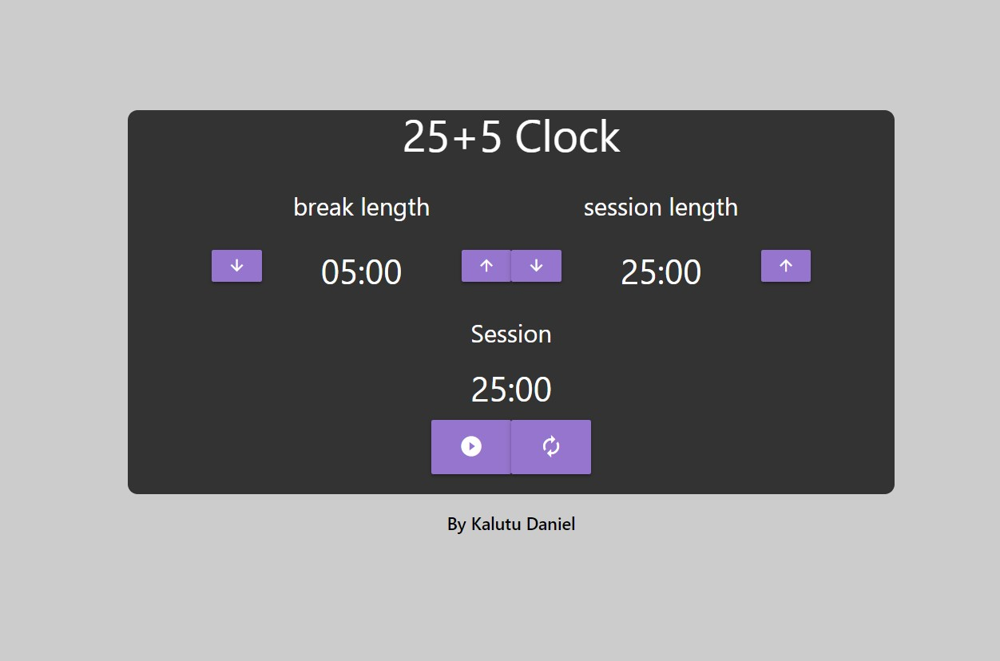

# Time Master (25 + 5 Clock)
Time Master is a timer application built using React. It allows users to set the length of a session and break time and provides a countdown timer.

## Preview

## Features
- Set session length: Users can define the length of the session (work time) in minutes.
- Set break length: Users can specify the length of the break time in minutes.
- Countdown timer: The application displays a countdown timer that shows the remaining time for the current session or break.
- Audio notification: When the timer reaches zero, an audio notification is played to indicate the start of the break time.
- Pause and resume: Users can pause and resume the timer as needed.
- Reset: Users can reset the timer to its initial state.

## Getting Started
To run Time Master on your local machine, follow these steps:

1. Clone the repository: `git clone https://github.com/your-username/time-master.git`
2. Navigate to the project directory: `cd time-master`
3. Install the dependencies: `npm install`
4. Start the development server: `npm start`
5. Open your web browser and visit `http://localhost:3000` to access Time Master.

## Usage
1. Set the session length: Use the "session length" controls to define the desired length for your work sessions.
2. Set the break length: Use the "break length" controls to specify the desired length for your break time.
3. Start the timer: Click the play button to start the timer. The countdown will begin for the session length.
4. Pause and resume: Click the play button again to pause the timer. Click it once more to resume the timer.
5. Reset the timer: Click the reset button to reset the timer to its initial state.

## Technologies Used
- React: A JavaScript library for building user interfaces.
- HTML: The standard markup language for creating web pages.
- CSS: A stylesheet language used for describing the presentation of a document.

## Contributing
Contributions to the 25 + 5 Clock application are welcome! If you find any issues or have suggestions for improvements, please open an issue or submit a pull request.

## Credits
This 25 + 5 Clock project is part of the [FreeCodeCamp Frontend Certification](https://www.freecodecamp.org/learn/front-end-libraries/) course. It was completed as one of the required projects in the curriculum.

FreeCodeCamp (FCC) is a nonprofit organization that offers a comprehensive web development curriculum and certifications. The Frontend Certification focuses on frontend libraries and frameworks like React, and it covers various topics including HTML, CSS, JavaScript, and more.

Learn more about FreeCodeCamp and their educational programs on their official website: [https://www.freecodecamp.org/](https://www.freecodecamp.org/)

